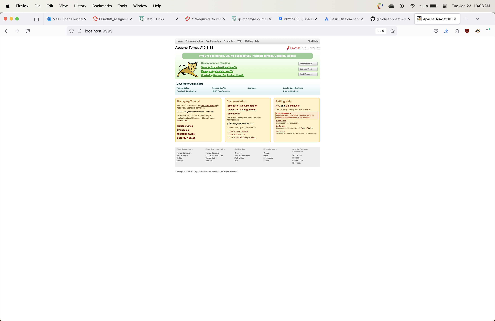
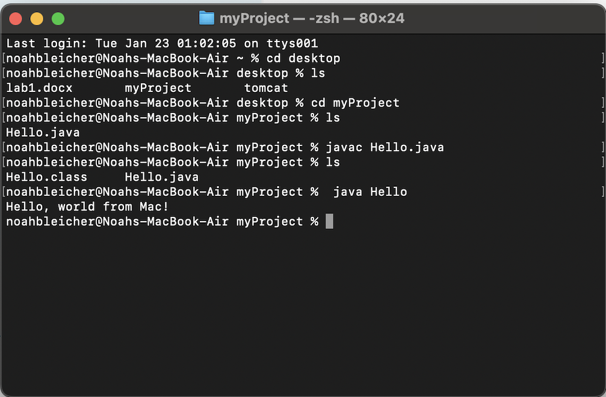
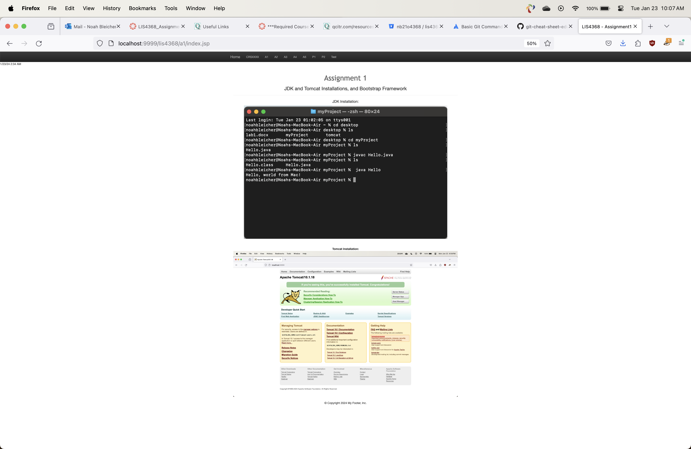

> **NOTE:** This README.md file should be placed at the **root of each of your repos directories.**
>
>Also, this file **must** use Markdown syntax, and provide project documentation as per below--otherwise, points **will** be deducted.
>

# LIS4368

## Noah Bleicher

### Assignment #1 Requirements:

*Sub-Heading:*

1. Distributed Version Contro with Git and Bitbucket
2. Installed AMPPS, JDK, and Visual Studio Code
3. cloned assignment starter files
4. reviewed and modified .jsp files
5. pushed local repo to bitbucket

#### README.md file should include the following items:

* Bullet-list items
* Screenshot of running java Hello
* Screenshot of running http://localhost:9999 
* Screenshot of a1/index.jsp
* git commands w/short descriptions
* Bitbucket repo links
* https://bitbucket.org/nb21o4368/lis4368/src/master/
* https://bitbucket.org/nb21o4368/bitbucketstationlocations/src/main/

> This is a blockquote.
> 
> This is the second paragraph in the blockquote.
>
> #### Git commands w/short descriptions:

1. git init **initializes git in sub directory as a repo**
2. git status **shows modified files**
3. git add adds **file to next commit**
4. git commit **commit content**
5. git push **pushes local commit to remote repo**
6. git pull **fetches any commits from remote repo**
7. git log **shows commit history**

#### Assignment Screenshots:

*Screenshot of AMPPS running http://localhost*:

*Screenshot of running java Hello*:

*Screenshot of a1 - index.jsp*:

#### Tutorial Links:

*Bitbucket Tutorial - Station Locations:*
[A1 Bitbucket Station Locations Tutorial Link](https://bitbucket.org/username/bitbucketstationlocations/ "Bitbucket Station Locations")

*Tutorial: Request to update a teammate's repository:*
[A1 My Team Quotes Tutorial Link](https://bitbucket.org/username/myteamquotes/ "My Team Quotes Tutorial")