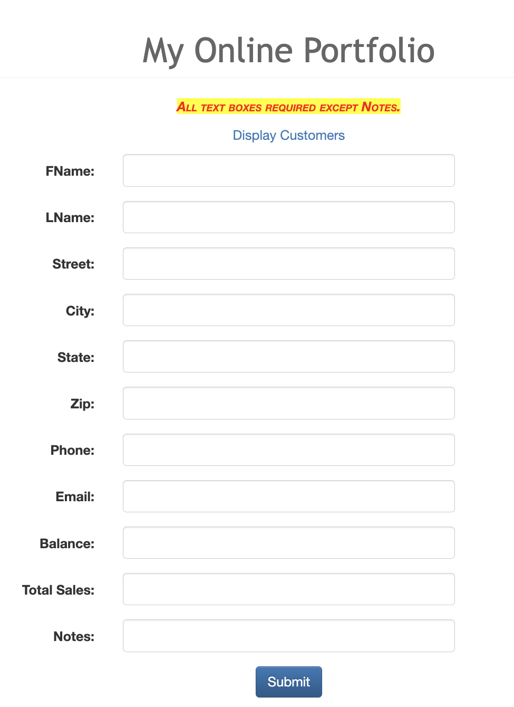
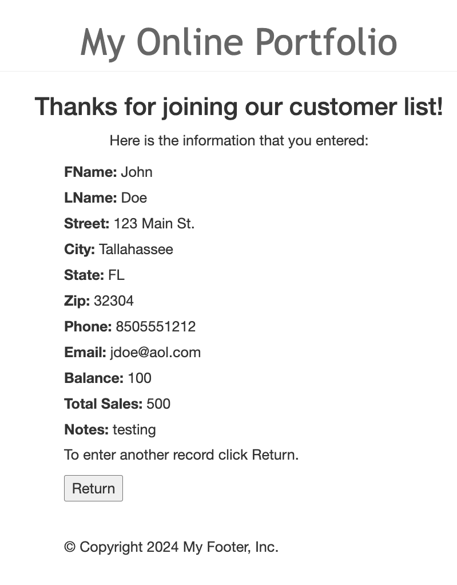
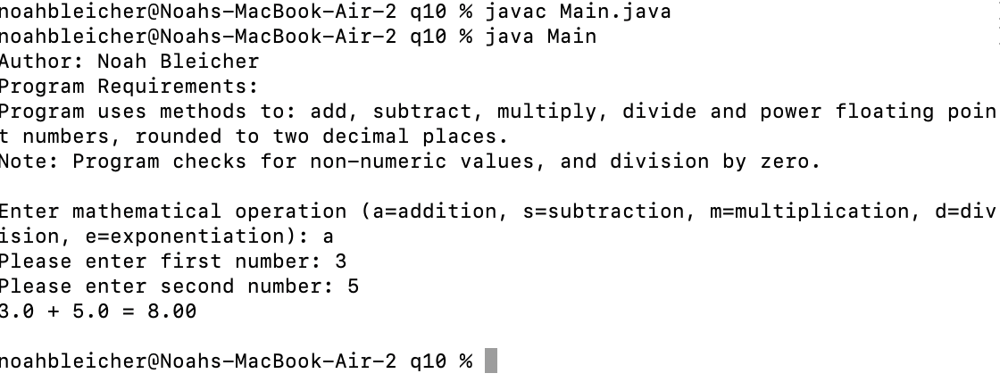
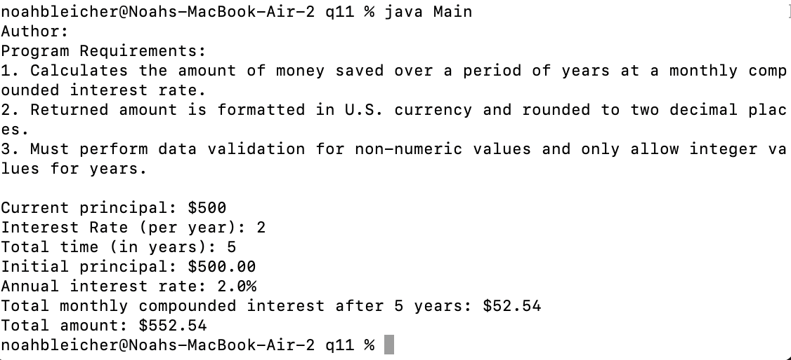
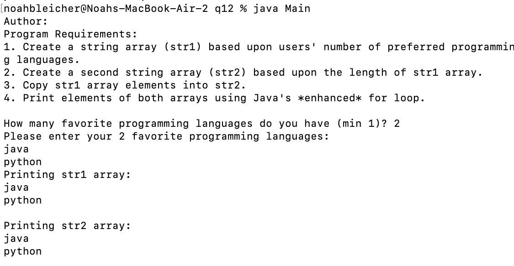

> **NOTE:** This README.md file should be placed at the **root of each of your repos directories.**
>
>Also, this file **must** use Markdown syntax, and provide project documentation as per below--otherwise, points **will** be deducted.
>

# LIS4368

## Noah Bleicher

### Assignment #4 Requirements:

*Sub-Heading:*

1. added server-side validation
2. compiled servlet files 
3. pushed all files and changes to git

#### README.md file should include the following items:

* screenshot of failed validation
* screenshot of passed validation
* screenshot of skill sets

#### Assignment Screenshot and Links:
*Screenshot of failed validation*:

*Screenshot of passed validation*:

*Screenshot of skill set 10*:

*Screenshot of skill set 11*:

*Screenshot of skill set 12*:

