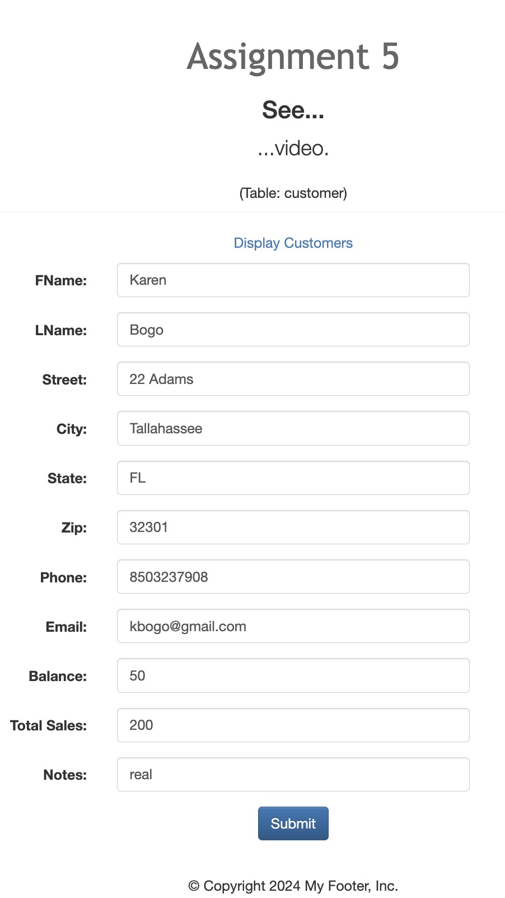
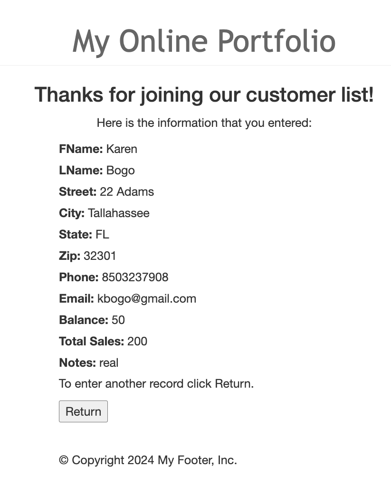
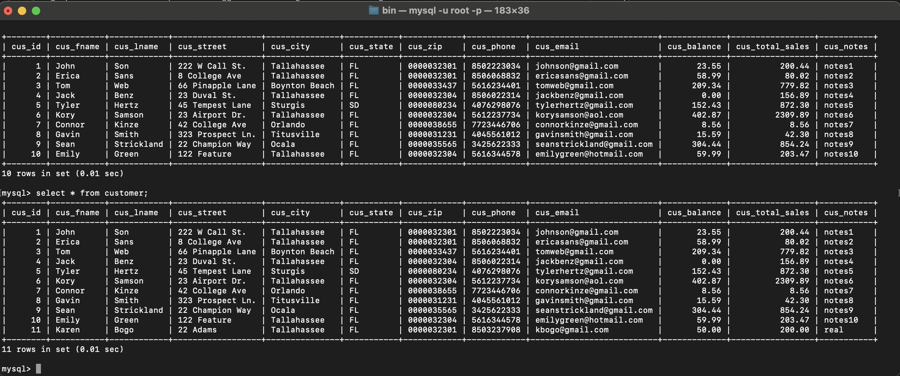
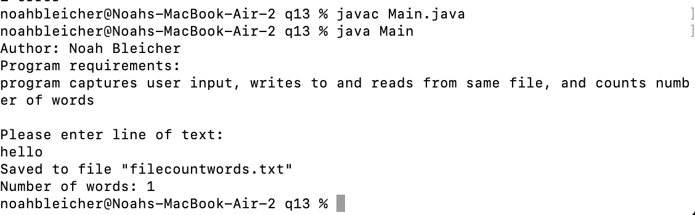
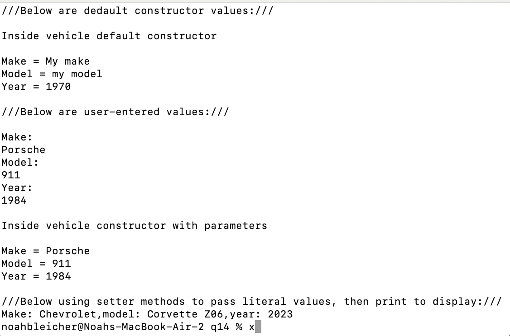
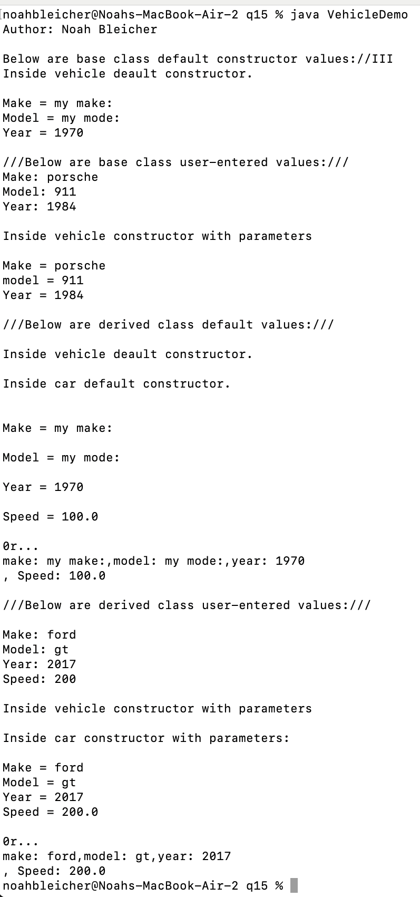

# LIS4368

## Noah Bleicher

### Assignment #5 Requirements:

*Sub-Heading:*

1. created servlet that communicates with database
2. established connection pool
3. pushed all files and changes to git

#### README.md file should include the following items:

* screenshot of valid entry
* screenshot of passed validation
* screenshot of updated table
* screenshot of skill sets

#### Assignment Screenshot and Links:

| Valid Entry               | Passed Validation              | Updated Table               |
| ---------------------- | ---------------------- | ---------------------- |
|  |  |  |
|             |            |               |

| Skillset 13             | Skillset 14              | Skillset 15              |
| ---------------------- | ---------------------- | ---------------------- |
|  |  |  |
|             |            |               |

