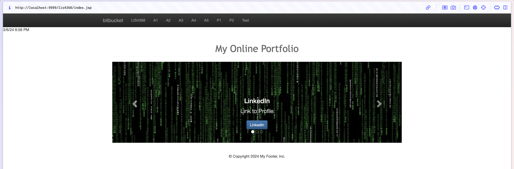
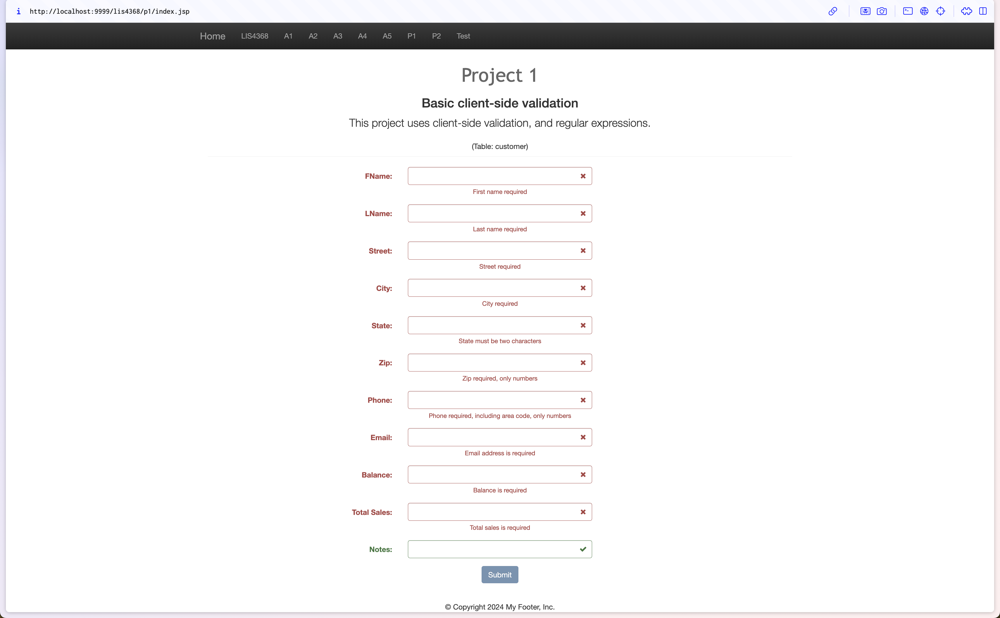
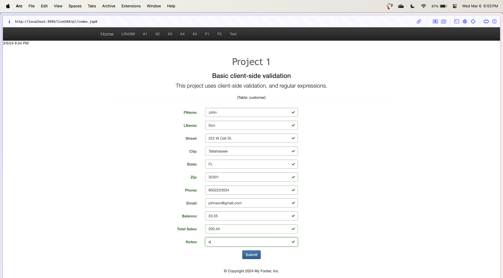
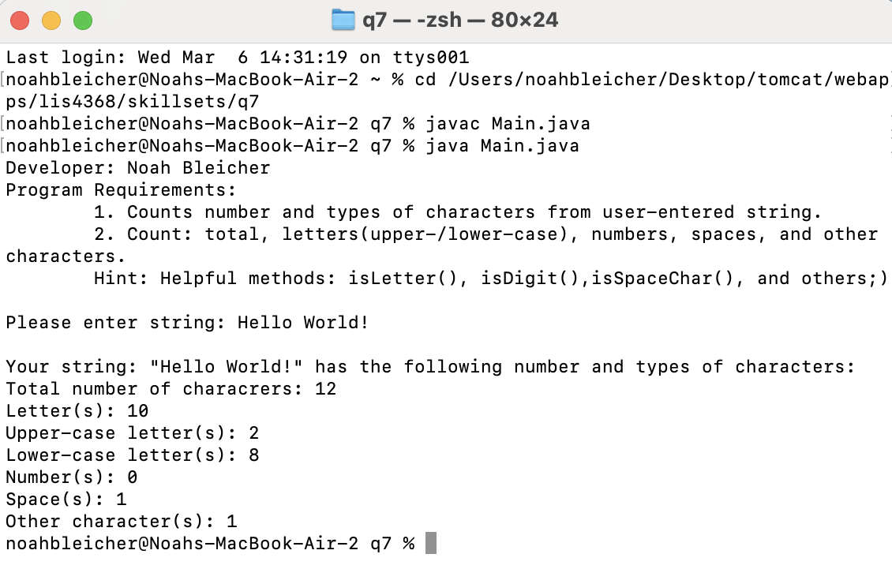
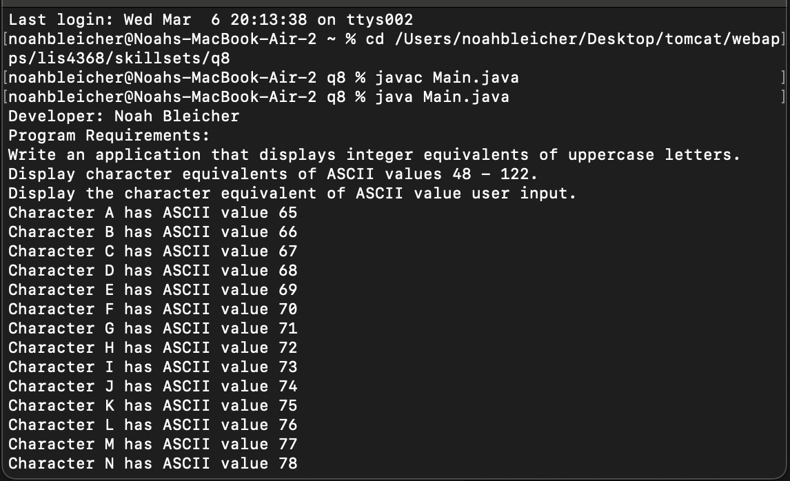
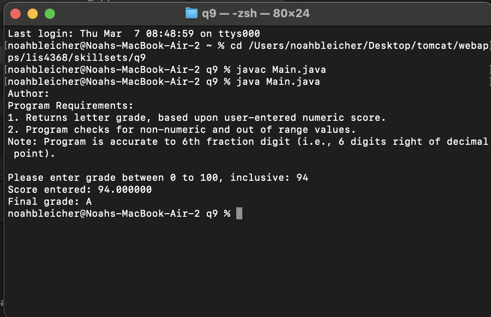

> **NOTE:** This README.md file should be placed at the **root of each of your repos directories.**
>
>Also, this file **must** use Markdown syntax, and provide project documentation as per below--otherwise, points **will** be deducted.
>

# LIS4368

## Noah Bleicher

### Project #1 Requirements:
- added state, zip, phone, balance, and total_sales 
- added jQuery validation and regular expressions as per attribute requirements using client-side validation
- added to tomcat webapps
- pushed to bitbucket

#### README.md file should include the following items:

* lis4368 portal
* failed validation
* passed validation
* skillsets 7-9

#### Project Screenshots;
*Screenshot LIS4368 Portal*:

*Screenshot failed validation*:

*Screenshot passed validation*:

*Screenshot skillsets 7-9*:

