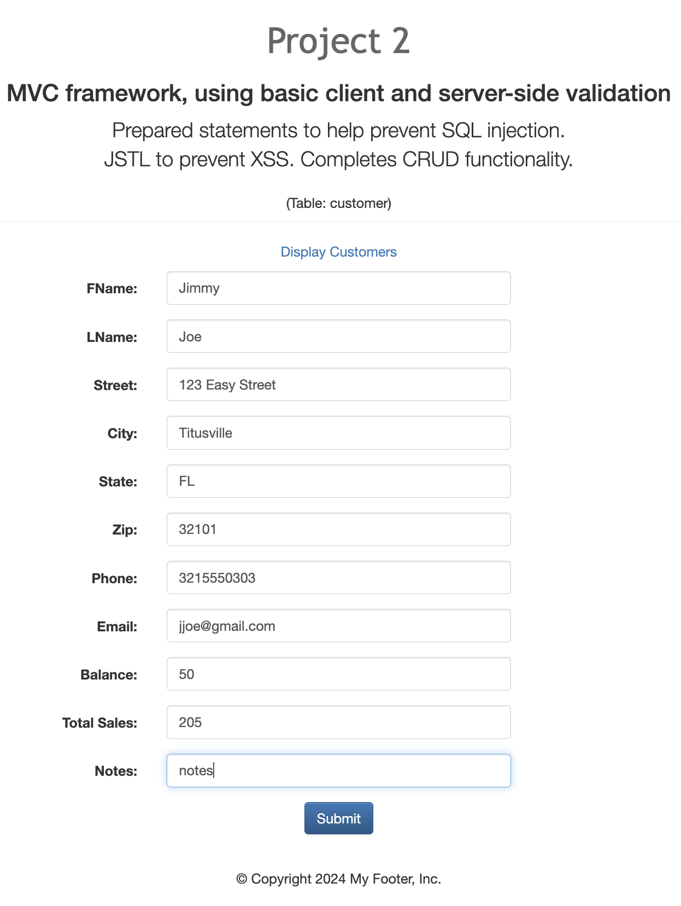
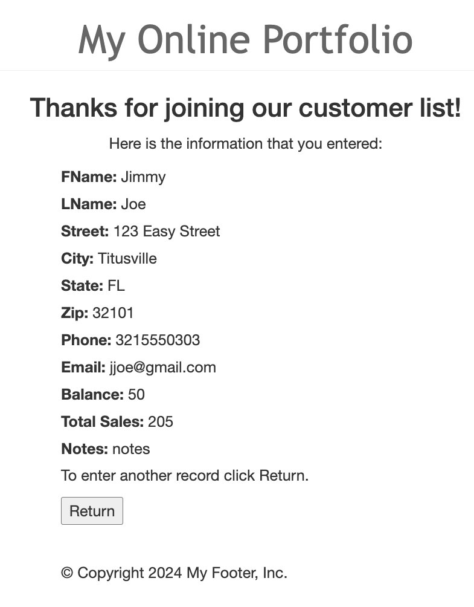
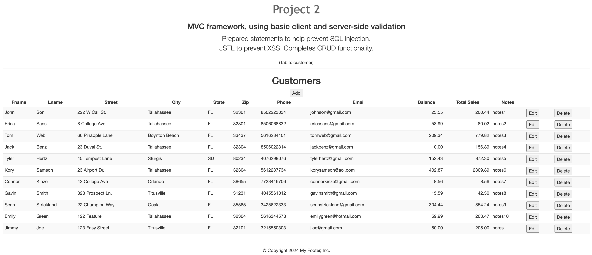
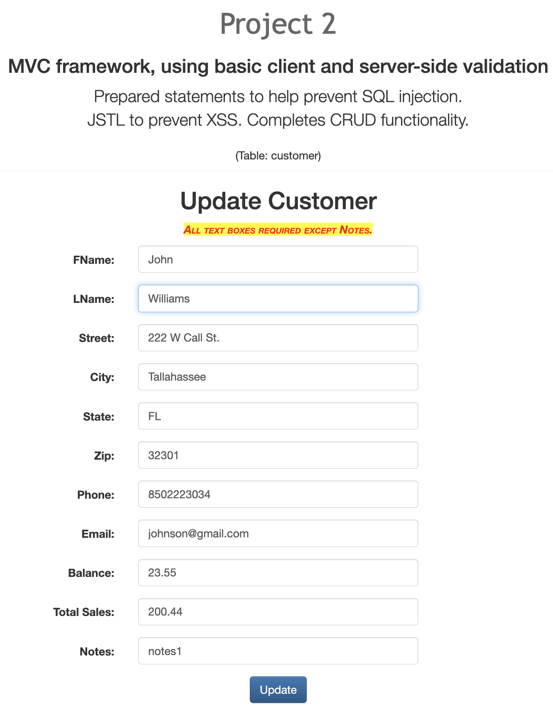
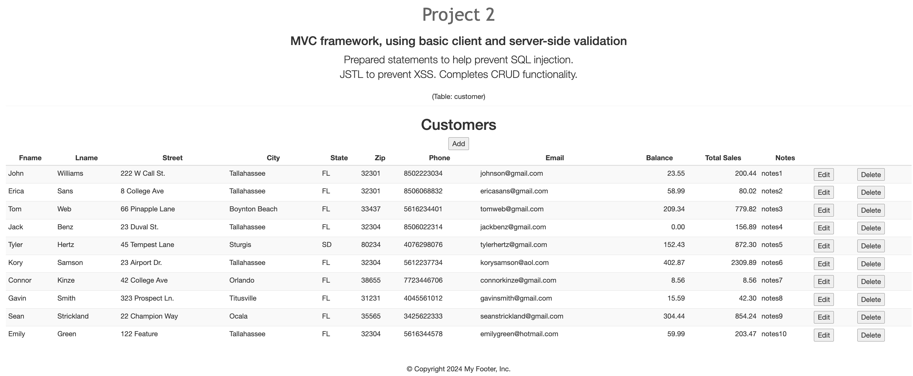
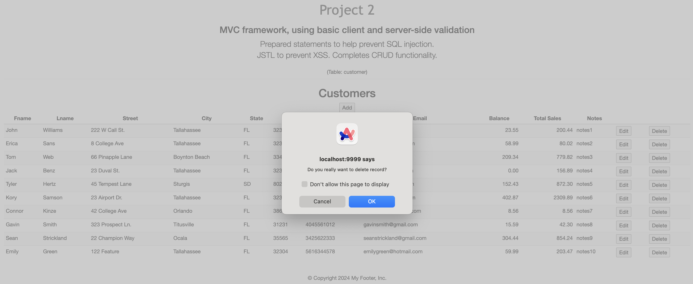
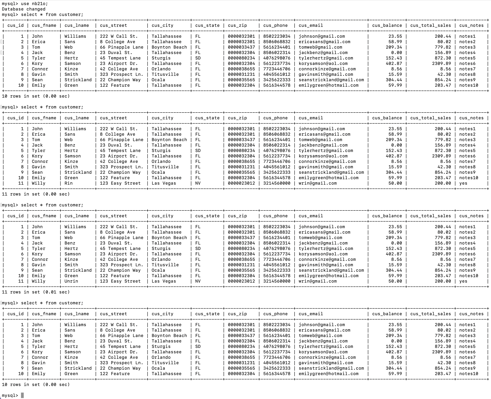

# LIS4368

## Noah Bleicher

### Project #2 Requirements:

*Sub-Heading:*

1. prevented cross side scripting.
2. created array list in customer.jsp to show data.
3. added client and server side validation to modify client data.
4. added ability to insert, update, and delete data from field.

#### README.md file should include the following items:

* screenshot of valid entry
* screenshot of passed validation
* screenshot of data being displayed
* screenshot of modified forms
* screenshot of modified data
* screenshot of delete warning
* screenshot of database changes

#### Assignment Screenshot and Links:

| Valid Entry               | Passed Validation              | Displayed Data Table               |
| ---------------------- | ---------------------- | ---------------------- |
|  |  |  |
|             |            |               |

| Modify Form            | Modified Data              | Delete Warning             |
| ---------------------- | ---------------------- | ---------------------- |
|  |  |  |
|             |            |               |

*Screenshot of associated database changes*:

